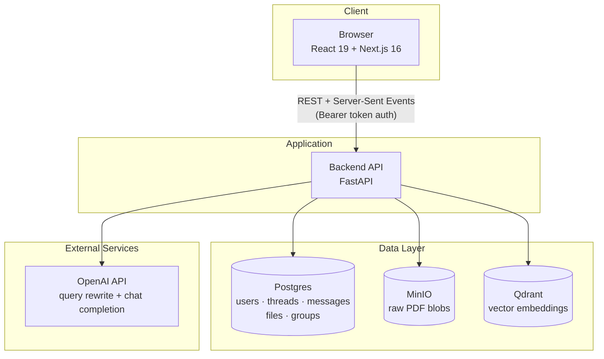
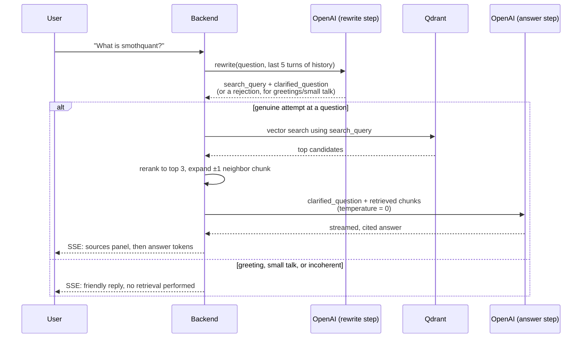

# Agora

Agora is a self-hosted RAG (Retrieval-Augmented Generation) chat application. Upload PDF documents, ask questions about them in natural language, and get answers grounded in the actual document content — with inline citations back to the source file and page, role-based access control over who can see what, and a multi-stage query pipeline built to resist hallucination and false refusals.

## Demo

https://github.com/user-attachments/assets/1d2e4f18-5e2e-4668-8337-faa976c88bc3

> 📖 **Auto-generated deep-dive docs:** [deepwiki.com/hassaanmuzammil/agora](https://deepwiki.com/hassaanmuzammil/agora)

## Table of Contents

- [Architecture](#architecture)
- [How a Chat Message Actually Works](#how-a-chat-message-actually-works)
- [Features](#features)
- [Tech Stack](#tech-stack)
- [Project Structure](#project-structure)
- [Getting Started](#getting-started)
- [Demo Accounts](#demo-accounts)
- [Access Control](#access-control)
- [RAG Pipeline Deep Dive](#rag-pipeline-deep-dive)
- [API Reference](#api-reference)
- [Known Limitations / Roadmap](#known-limitations--roadmap)
- [Demo](#demo)

## Architecture



The frontend never talks to Postgres, MinIO, Qdrant, or OpenAI directly — every request goes through the FastAPI backend, which is the only service holding credentials for the data layer and the only service that enforces access control before any retrieval happens.

## How a Chat Message Actually Works

Every message you send goes through a small pipeline, not a single LLM call:



Two design decisions here are the product of real bugs found and fixed during this project (see [RAG Pipeline Deep Dive](#rag-pipeline-deep-dive) for the full story):

1. **The rewrite step produces two different outputs, not one.** `search_query` is allowed to be loose and expansive — it's only used for finding candidate chunks. `clarified_question` must stay faithful to exactly what you asked, just with pronouns resolved and typos fixed — it's what the final-answer model actually sees, so it can't quietly broaden your question into something the retrieved content doesn't cover.
2. **The rewrite step's only job is "is this a real question," not "do we have an answer."** A well-formed question about something the corpus has zero content on (e.g. asking about photosynthesis when only ML papers are uploaded) is expected to pass this step — the honest "I don't have this" call is made later, by the answer step actually reading what got retrieved.

## Features

- **Chat with your documents** — ask questions in natural language; answers are generated only from retrieved document content, with inline citations (file name + page number)
- **Conversation threads** — multi-turn conversations with follow-up support; pronouns and vague references ("it", "that") get resolved using recent chat history before retrieval runs
- **Typo-tolerant, tone-aware query understanding** — a misspelled technical term doesn't get bounced back as "please clarify"; greetings and small talk get a warm, human reply instead of a robotic prompt for more context
- **File management** — upload, preview, download, and delete PDF documents, with duplicate-upload protection per user
- **Role-based access control** — admin vs. regular user roles, plus group-based file sharing; a file can be scoped to specific groups instead of being fully private or fully public, enforced at the retrieval layer, not just the file list
- **Groups admin UI** — create groups and manage membership entirely from the UI, no API calls required
- **Feedback** — thumbs up/down on individual answers, stored per message

## Tech Stack

| Layer | Technology |
|---|---|
| Frontend | Next.js 16 (App Router), React 19, TypeScript, Tailwind CSS |
| Backend | FastAPI, SQLAlchemy (async), Pydantic Settings |
| Database | Postgres (users, threads, messages, files, groups, sessions) |
| Object storage | MinIO (S3-compatible, stores raw PDF blobs) |
| Vector store | Qdrant (dense + sparse hybrid search) |
| Embeddings | `all-MiniLM-L6-v2` (dense), `Qdrant/bm25` (sparse), via `fastembed` |
| Reranking | `cross-encoder/ms-marco-MiniLM-L-6-v2` |
| LLM | OpenAI (`gpt-4o-mini` by default) — query rewriting and final answer generation |
| Orchestration | LangChain (document loading, text splitting, retriever composition) |
| Infra | Docker Compose |

## Project Structure

```
backend/
  app/
    api/            # FastAPI routers: auth, files, groups, threads, feedback
    core/           # Settings (pydantic-settings, reads .env)
    db/             # SQLAlchemy models, session, base
    rag/            # The RAG pipeline itself
      pipeline.py     # Orchestrates load -> index -> retrieve
      llm.py          # OpenAI calls: query_rewrite(), build_context()
      retriever.py    # Hybrid dense+sparse retriever + reranker factory
      qdrant_store.py # Qdrant client setup, point deletion by source
      docstore.py     # Postgres-backed doc store for neighbor-chunk lookup
      templates/      # query_rewrite.txt, final_answer.txt — the actual prompts
    schemas/        # Pydantic request/response models
  scripts/
    create_user.py  # Parameterized user provisioning (--email --password --admin)

frontend/
  app/              # Next.js App Router pages: /, /files, /groups, /thread/[id]
  components/       # UI components, grouped by feature (auth, chat, files, layout)
  hooks/            # useAuth, useThreads, useFiles, useGroupMembers
  services/         # Typed API clients (one per resource) + shared fetch wrapper
  types/            # Shared TypeScript types matching backend schemas

postgres/
  schema.sql        # Auto-applied to a fresh Postgres volume on first boot

docker-compose.yml  # Full stack orchestration
```

## Getting Started

There are two ways to run this: fully via Docker (simplest, closest to production), or with the app running natively and only the infrastructure (Postgres/MinIO/Qdrant) in Docker (best for active development — hot reload, breakpoints, faster iteration). Both are fully tested end-to-end.

### Prerequisites (both paths)

- Docker Desktop (or Docker Engine + Compose)
- An OpenAI API key

### 1. Configure environment (both paths)

```bash
cp .env.example .env
```

Fill in `.env` with real values — at minimum, set `OPENAI_KEY`. The Postgres/MinIO credentials can be left as-is for local use, but change them for anything beyond your own machine.

### 2. Create the required Docker volumes (both paths)

`docker-compose.yml` expects these to already exist:

```bash
docker volume create pro-rag_postgres_data
docker volume create pro-rag_minio_data
docker volume create pro-rag_qdrant_data
```

---

### Path A: Everything via Docker

```bash
docker compose build
docker compose up -d
```

This starts Postgres, MinIO, Qdrant, the backend (`localhost:8000`, interactive docs at `/docs`), and the frontend (`localhost:3000`). The MinIO bucket and database schema are created automatically on first startup — no manual setup step required.

Create user accounts (see [Demo Accounts](#demo-accounts) / step 4 below), then skip to [Demo Accounts](#demo-accounts).

---

### Path B: App natively, infra via Docker

Use this when you're actively developing — hot reload on both backend and frontend, no rebuilding images per change.

**1. Start just the infrastructure:**

```bash
docker compose up -d postgres minio qdrant
```

**2. Run the backend** (requires Python 3.12 and [uv](https://docs.astral.sh/uv/)):

```bash
cd backend
uv sync
cd ..
backend/.venv/bin/uvicorn backend.app.main:app --reload --port 8000
```

Run this from the **repo root**, not from inside `backend/` — `backend.app.*` is imported as a package relative to the repo root (the same way it runs inside the Docker image).

**3. Run the frontend** (in a separate terminal, requires Node 20+):

```bash
cd frontend
npm install
echo "NEXT_PUBLIC_API_BASE_URL=http://localhost:8000" > .env.local
npm run dev
```

Frontend is now at `localhost:3000`, talking to the natively-running backend at `localhost:8000`, which talks to the Dockerized Postgres/MinIO/Qdrant.

**Troubleshooting: "role postgres does not exist" or connection errors.** If you already have a Postgres instance running natively on your machine (common with Homebrew/`postgres.app` installs), it can silently intercept `localhost:5432` ahead of Docker's mapped port, even while Docker's container is healthy — different local Postgres installs bind to the port in ways that can take precedence over Docker's port-forwarding. Check with `lsof -i :5432` — if something other than `com.docker...` is listed, stop your local Postgres service (e.g. `brew services stop postgresql@<version>`) while running Agora, or remap Agora's Postgres to a different host port in `docker-compose.yml` and update `DATABASE_URL` in `.env` to match.

### 3. Create user accounts (both paths)

There's no self-service sign-up — accounts are provisioned directly:

```bash
# Docker path
docker exec agora-backend python -m backend.scripts.create_user --email admin@example.com --password yourpassword --admin

# Native path (from repo root, using the backend venv)
backend/.venv/bin/python -m backend.scripts.create_user --email admin@example.com --password yourpassword --admin
```

Omit `--admin` for a regular user, and re-run with different `--email`/`--password` for additional accounts.

## Demo Accounts

For local evaluation, these two accounts are commonly seeded:

| Email | Password | Role |
|---|---|---|
| `admin@example.com` | `password123` | Admin |
| `user@example.com` | `password123` | Regular user |

## Access Control

- **Admin** gets a "Groups" tab (hidden for regular users) to create groups, add/remove members, and control which groups a file is shared with from the Files page.
- **Regular users** can only see and query files they uploaded, or files shared with a group they belong to.
- Access is enforced at the retrieval layer, not just the file list — a user without access to a file cannot pull answers from its content either, since the Qdrant search itself is filtered by the caller's allowed file set before anything is retrieved.
- Creating a user account is currently a backend/script task (see above), not a UI flow — this is a scoped decision for now, not an oversight (see [Roadmap](#known-limitations--roadmap)).

## RAG Pipeline Deep Dive

This section documents the actual retrieval/generation tuning behind the app — these are real, tested design decisions, not defaults left untouched.

**Retrieval:**
- Hybrid dense + sparse search: `all-MiniLM-L6-v2` dense embeddings combined with `Qdrant/bm25` sparse vectors, so both semantic similarity and exact keyword matches contribute to candidate selection
- Top 20 candidates (`RETRIEVE_K`) are pulled from Qdrant, then narrowed to the top 3 (`RERANK_TOP_N`) by a `cross-encoder/ms-marco-MiniLM-L-6-v2` reranker
- Each of those 3 chunks gets its immediate neighbor (±1) pulled in for continuity, so a chunk cut off mid-sentence isn't missing its conclusion

**Query understanding (two outputs from one LLM call, not one):**
- `search_query` — used only for the Qdrant search above; allowed to be loose/expansive since a slightly-too-broad search just adds a few extra candidates
- `clarified_question` — used only for the final-answer step; must preserve the exact scope of the original question (no added sub-questions, no guessed domains) while resolving pronouns and fixing typos, since the final-answer step never sees conversation history directly — this field is its only chance to understand what "it" or "that" referred to
- A misspelled or unfamiliar term is explicitly *not* treated as grounds for rejecting a question — only genuine non-questions (greetings, small talk, harmful requests, true gibberish) get rejected before retrieval

**Answer generation:**
- `temperature=0` on both OpenAI calls — verified via repeated identical-prompt testing that the default (unset) temperature caused the same prompt to sometimes answer and sometimes falsely refuse; determinism removes that as a variable entirely
- The final-answer prompt explicitly tells the model to use whichever retrieved chunks are relevant and ignore the rest, only refusing if *none* of the context relates to the question at all — without this, a good 3-chunk retrieval diluted by tangential neighbor chunks (e.g. benchmarks, references) could tip the model into refusing to answer even when a clearly relevant chunk was sitting right there in the context

## API Reference

Full interactive documentation (request/response schemas, try-it-out) is available at `http://localhost:8000/docs` once the backend is running. High-level endpoint groups:

| Group | Endpoints | Notes |
|---|---|---|
| Auth | `POST /auth/login`, `POST /auth/logout`, `GET /auth/me` | Bearer token sessions, 30-day expiry |
| Threads | `GET/POST /threads`, `GET/PATCH/DELETE /threads/{id}`, `POST /threads/{id}/messages` | Messages endpoint streams via Server-Sent Events |
| Files | `GET/POST /files`, `GET/DELETE /files/{id}`, `GET /files/{id}/content`, `PUT /files/{id}/groups` | Upload triggers indexing synchronously; `PUT .../groups` is admin-only |
| Groups | `GET/POST /groups`, `POST/DELETE /groups/{id}/members/{user_id}`, `GET /users` | Creation and membership management are admin-only |
| Feedback | `POST /threads/{thread_id}/messages/{message_id}/feedback` | Thumbs up/down + optional comment |

## Known Limitations / Roadmap

- No self-service sign-up — users are provisioned via the backend script above.
- No admin UI for creating users or promoting/demoting admins — this is a database/script-level action today (group creation and membership do have a UI, under "Groups").
- Only one file type is supported for upload: PDF.
- No rate limiting on chat requests — be mindful of this if exposing an instance publicly with a real API key.
- Not yet deployed to a public host — local Docker Compose only, for now.

